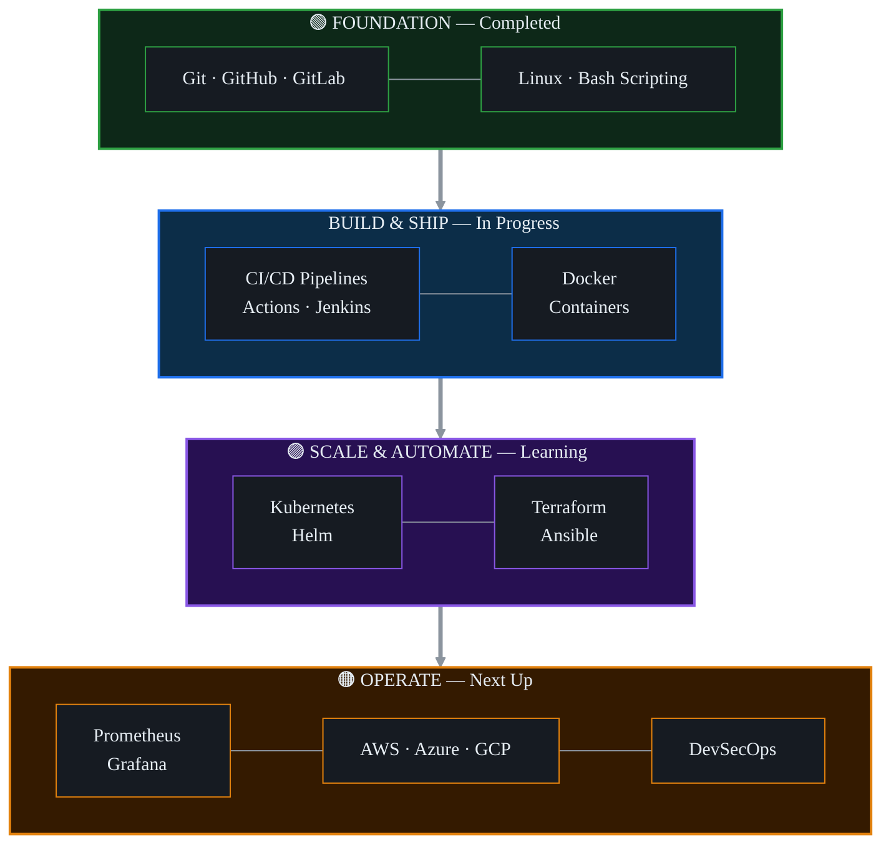

<!-- ═══════════════ ANIMATED HEADER ═══════════════ -->

<!-- ═══════════════ TYPING ANIMATION ═══════════════ -->

<!-- ═══════════════ ANIMATED LINE DIVIDER ═══════════════ -->

<!-- ═══════════════ BADGES ROW ═══════════════ -->

<!-- ═══════════════ 1. ABOUT ME ═══════════════ -->
##  About Me

Hi, I'm **** 👋 — from **Afghanistan** 🇦🇫, currently pursuing a **Master's in Data Science** at **IMSciences, Peshawar, Pakistan**. I hold a **Bachelor's in Computer Science** from the same institute.

I am passionate about leveraging **AI, Machine Learning, Data Science, and Full-Stack Development** to solve practical, real-world problems. I combine strong technical expertise in **programming, networking, databases, hardware, and system design** with experience in **project management** to deliver efficient and scalable solutions.

- 🔭 Currently working on **ML + IoT and Data Science projects**
- 🌱 Learning **DevOps, Cloud & Infrastructure as Code**
- 🗣️ Built ML models for **Pashto Sentiment Analysis** (low-resource language NLP!)
- 🌐 Certified network professional — **CCNA & CCNP**
- 💬 Ask me about **Python, ML, Networking, and Web Development**
- 📫 Reach me at **ibrahimkhil975@gmail.com**

 

<!-- ═══════════════ 2. TECH STACK ═══════════════ -->
##  Tech Stack — What I Work With

### 👨‍💻 Languages

### 🌐 Web Frameworks & Libraries

### 🤖 Data Science & AI

 

### 🗄️ Databases & Desktop GUI

### 🌐 Networking & Systems

 

<!-- ═══════════════ 3. PROJECTS (what I've BUILT) ═══════════════ -->
##  Key Projects — What I've Built

<table>
<tr>
<td width="50%" valign="top">

### 🌱 Drip Irrigation System (ML + IoT)
> Intelligent indoor plant irrigation using multiple ML models + IoT sensors for smart automation.

  

</td>
<td width="50%" valign="top">

### 💬 Pashto Sentiment Analysis
> NLP for a low-resource language — ML models analyzing Pashto text sentiment.

  

</td>
</tr>
<tr>
<td width="50%" valign="top">

### 🎓 Student Management System
> Full-featured desktop app for managing student records.

 

</td>
<td width="50%" valign="top">

### 🖥️ PyQt Desktop Applications
> Collection of interactive, modern desktop applications.

 

</td>
</tr>
<tr>
<td width="50%" valign="top">

### ✂️ Tailor Shop Management System
> Web app streamlining tailor shop operations, orders & billing.

  

</td>
<td width="50%" valign="top">

### 🍽️ Restaurant Management System
> Web app for restaurant orders, menu & inventory management.

  

</td>
</tr>
<tr>
<td width="50%" valign="top">

### 🤖 Machine Learning Models
> Predictive analysis, classification & optimization across domains.

 

</td>
<td width="50%" valign="top">

### 📊 Data Analysis & Visualization
> EDA and rich visualizations for insight generation.

 

</td>
</tr>
</table>

<!-- ═══════════════ 4. DEVOPS LEARNING JOURNEY (what I'm LEARNING) ═══════════════ -->
##  My DevOps Learning Journey

### 📊 Progress at a Glance

| # | Stage | Tools | Status | Progress |
|:---:|:---|:---|:---:|:---|
| 1️⃣ | Version Control | Git • GitHub • GitLab | ✅ Done |  |
| 2️⃣ | Linux & Scripting | Bash • Kali • Ubuntu | ✅ Done |  |
| 3️⃣ | CI/CD | Actions • GitLab CI • Jenkins | 🔄 Learning now |  |
| 4️⃣ | Containers | Docker • Compose | 🔄 Learning now |  |
| 5️⃣ | Orchestration | Kubernetes • Helm | 📚 Started |  |
| 6️⃣ | IaC | Terraform • Ansible | 📚 Started |  |
| 7️⃣ | Monitoring | Prometheus • Grafana | 🎯 Next |  |
| 8️⃣ | Cloud | AWS • Azure • GCP | 🎯 Next |  |
| 9️⃣ | DevSecOps | Vault • SonarQube | 🎯 Next |  |

<b>🔽 Click to expand the full 9-stage roadmap with details</b>

 

### 🔀 Stage 1 — Version Control & Collaboration ✅

> 🎯 Branching & Merging • Pull/Merge Requests • Git Flow • Code Reviews • Repo Management

### 🐧 Stage 2 — Linux & Scripting ✅

> 🎯 Shell Scripting • Permissions • Cron Jobs • Process Management • Networking Commands

### ⚙️ Stage 3 — CI/CD Pipelines 🔄

> 🎯 Automated Builds • Testing Automation • Continuous Deployment • Pipeline as Code • Artifacts

### 🐳 Stage 4 — Containerization 🔄

> 🎯 Dockerfiles • Images & Layers • Multi-Stage Builds • Networks & Volumes • Registries

### ☸️ Stage 5 — Container Orchestration 📚

> 🎯 Pods & Deployments • Services & Ingress • ConfigMaps & Secrets • Auto-Scaling • Helm Charts

### 🏗️ Stage 6 — Infrastructure as Code 📚

> 🎯 Terraform Modules & State • Ansible Playbooks & Roles • Provisioning • Config Management

### 📊 Stage 7 — Monitoring & Observability 🎯

> 🎯 Metrics & Alerting • Dashboards • Log Aggregation (ELK) • Tracing • Incident Response

### ☁️ Stage 8 — Cloud Platforms 🎯

> 🎯 EC2/VMs • S3/Blob Storage • VPC & Networking • IAM Security • Serverless Functions

### 🔐 Stage 9 — DevSecOps & Security 🎯

> 🎯 Secrets Management • Vulnerability Scanning • Firewall Admin 💪 • Network Security (CCNA/CCNP)

<!-- ═══════════════ 5. CERTIFICATIONS ═══════════════ -->
##  Certifications

| 🏅 | Certification | Institute |
|:---:|:---|:---|
| 🌐 | **CCNA** — Cisco Certified Network Associate | CARVIT, Peshawar |
| 🌐 | **CCNP** — Cisco Certified Network Professional | CARVIT, Peshawar |
| 🔥 | **Firewall Administration** | CARVIT, Peshawar |
| 🖥️ | **Windows Server 2016 Administration** | CARVIT, Peshawar |

 

<!-- ═══════════════ 6. GITHUB STATS ═══════════════ -->
##  GitHub Analytics

<!-- GitHub Stats Cards (Always works - uses different service) -->

  

<!-- Stats Cards Row -->

  

<!-- GitHub Streak (Alternative service) -->

  

<!-- Activity Graph (Alternative) -->

  

<!-- Metrics with achievements plugin -->

  

<!-- Snake Animation -->

<!-- ═══════════════ 7. CONTACT ═══════════════ -->
<!-- ═══════════════ 7. CONTACT ═══════════════ -->
##  Connect With Me

<!-- Professional Social Links -->

&nbsp;

&nbsp;

&nbsp;

&nbsp;

&nbsp;

  

<!-- Professional Footer -->

 

📧 **ibrahimkhil975@gmail.com** &nbsp;|&nbsp; 📱 **+93 788 770 458** &nbsp;|&nbsp; 📍 **Kabul, Afghanistan**

  

<!-- Portfolio Link Button -->

  

