<div align="center">

<!-- ═══════════════ ANIMATED HEADER ═══════════════ -->


<!-- ═══════════════ TYPING ANIMATION ═══════════════ -->
<a href="#"></a>

<!-- ═══════════════ ANIMATED LINE DIVIDER ═══════════════ -->


<!-- ═══════════════ BADGES ROW ═══════════════ -->
<p>


</p>

</div>

<!-- ═══════════════ ABOUT ME ═══════════════ -->
##  About Me


```yaml
name: Khairullah
from: Afghanistan 🇦🇫
education:
  masters: "Data Science @ IMSciences, Peshawar 🎓"
  bachelors: "Computer Science @ IMSciences, Peshawar"
current_focus:
  - "🤖 Machine Learning + IoT Projects"
  - "🚀 DevOps: Docker → K8s → Terraform"
  - "☁️  Cloud Infrastructure & Automation"
superpowers:
  - "🗣️ Pashto NLP (low-resource language ML!)"
  - "🌐 CCNA + CCNP Networking"
  - "💻 Full-Stack: Laravel, Django, JS"
motto: "Code. Deploy. Automate. Repeat. ♾️"
```

<br clear="right"/>

<div align="center">

</div>

<!-- ═══════════════ TECH STACK WITH ANIMATED ICONS ═══════════════ -->
##  Tech Stack — Animated Icons

### 👨‍💻 Languages
<div align="center">

</div>

### 🌐 Web Frameworks & Libraries
<div align="center">

</div>

### 🤖 Data Science & AI
<div align="center">

<br/>


</div>

### 🗄️ Databases & Tools
<div align="center">

</div>

### 🌐 Networking & Systems
<div align="center">

<br/>


</div>

<div align="center">

</div>

<!-- ═══════════════ DEVOPS ROADMAP ═══════════════ -->
##  Complete DevOps Roadmap

<div align="center">


<!-- DevOps Infinity Animation -->


</div>



```mermaid
%%{init: {'theme':'dark', 'themeVariables': {'primaryColor':'#7B42BC','primaryTextColor':'#fff','lineColor':'#00D9FF'}}}%%
graph LR
    A[📝 Code] ==> B[🔀 Git/GitHub/GitLab]
    B ==> C[⚙️ CI/CD Pipelines]
    C ==> D[🐳 Docker]
    D ==> E[☸️ Kubernetes]
    E ==> F[🏗️ Terraform/Ansible]
    F ==> G[📊 Monitoring]
    G ==> H[☁️ Cloud AWS/Azure/GCP]
    H ==> A
    style A fill:#1f6feb,stroke:#fff,color:#fff
    style B fill:#f05032,stroke:#fff,color:#fff
    style C fill:#d24939,stroke:#fff,color:#fff
    style D fill:#2496ed,stroke:#fff,color:#fff
    style E fill:#326ce5,stroke:#fff,color:#fff
    style F fill:#7b42bc,stroke:#fff,color:#fff
    style G fill:#e6522c,stroke:#fff,color:#fff
    style H fill:#ff9900,stroke:#fff,color:#fff
```

### 🔀 Stage 1 — Version Control & Collaboration ✅
<div align="center">

</div>

> 🎯 Branching & Merging • Pull/Merge Requests • Git Flow • Code Reviews • Repo Management

### 🐧 Stage 2 — Linux & Scripting ✅
<div align="center">

</div>

> 🎯 Shell Scripting • Permissions • Cron Jobs • Process Management • Networking Commands

### ⚙️ Stage 3 — CI/CD Pipelines 🔄
<div align="center">

</div>

> 🎯 Automated Builds • Testing Automation • Continuous Deployment • Pipeline as Code • Artifacts

### 🐳 Stage 4 — Containerization 🔄
<div align="center">


</div>

> 🎯 Dockerfiles • Images & Layers • Multi-Stage Builds • Networks & Volumes • Registries

### ☸️ Stage 5 — Container Orchestration 📚
<div align="center">


</div>

> 🎯 Pods & Deployments • Services & Ingress • ConfigMaps & Secrets • Auto-Scaling • Helm Charts

### 🏗️ Stage 6 — Infrastructure as Code 📚
<div align="center">


</div>

> 🎯 Terraform Modules & State • Ansible Playbooks & Roles • Provisioning • Config Management

### 📊 Stage 7 — Monitoring & Observability 🎯
<div align="center">

</div>

> 🎯 Metrics & Alerting • Dashboards • Log Aggregation (ELK) • Tracing • Incident Response

### ☁️ Stage 8 — Cloud Platforms 🎯
<div align="center">

</div>

> 🎯 EC2/VMs • S3/Blob Storage • VPC & Networking • IAM Security • Serverless Functions

### 🔐 Stage 9 — DevSecOps & Security 🎯
<div align="center">


</div>

> 🎯 Secrets Management • Vulnerability Scanning • Firewall Admin 💪 • Network Security (CCNA/CCNP)

<!-- ═══════════════ PROGRESS TRACKER ═══════════════ -->
<div align="center">

### 📊 Roadmap Progress Tracker

| Stage | Technology | Status | Progress |
|:---:|:---|:---:|:---|
| 1️⃣ | Git • GitHub • GitLab | ✅ Completed |  |
| 2️⃣ | Linux & Scripting | ✅ Completed |  |
| 3️⃣ | CI/CD Pipelines | 🔄 In Progress |  |
| 4️⃣ | Docker & Containers | 🔄 In Progress |  |
| 5️⃣ | Kubernetes & Helm | 📚 Learning |  |
| 6️⃣ | Terraform & Ansible | 📚 Learning |  |
| 7️⃣ | Prometheus & Grafana | 🎯 Next Up |  |
| 8️⃣ | AWS • Azure • GCP | 🎯 Next Up |  |
| 9️⃣ | DevSecOps | 🎯 Next Up |  |

</div>

<div align="center">

</div>

<!-- ═══════════════ PROJECTS ═══════════════ -->
##  Key Projects

<table>
<tr>
<td width="50%" valign="top">

### 🌱 Drip Irrigation System (ML + IoT)
> Intelligent indoor plant irrigation using multiple ML models + IoT sensors for smart automation.

  

</td>
<td width="50%" valign="top">

### 💬 Pashto Sentiment Analysis
> NLP for a low-resource language — ML models analyzing Pashto text sentiment.

  

</td>
</tr>
<tr>
<td width="50%" valign="top">

### 🎓 Student Management System
> Full-featured desktop app for managing student records.

 

</td>
<td width="50%" valign="top">

### 🖥️ PyQt Desktop Applications
> Collection of interactive, modern desktop applications.

 

</td>
</tr>
<tr>
<td width="50%" valign="top">

### ✂️ Tailor Shop Management System
> Web app streamlining tailor shop operations, orders & billing.

  

</td>
<td width="50%" valign="top">

### 🍽️ Restaurant Management System
> Web app for restaurant orders, menu & inventory management.

  

</td>
</tr>
<tr>
<td width="50%" valign="top">

### 🤖 Machine Learning Models
> Predictive analysis, classification & optimization across domains.

 

</td>
<td width="50%" valign="top">

### 📊 Data Analysis & Visualization
> EDA and rich visualizations for insight generation.

 

</td>
</tr>
</table>

<div align="center">

</div>

<!-- ═══════════════ CERTIFICATIONS ═══════════════ -->
##  Certifications

<div align="center">

| 🏅 | Certification | Institute |
|:---:|:---|:---|
| 🌐 | **CCNA** — Cisco Certified Network Associate | CARVIT, Peshawar |
| 🌐 | **CCNP** — Cisco Certified Network Professional | CARVIT, Peshawar |
| 🔥 | **Firewall Administration** | CARVIT, Peshawar |
| 🖥️ | **Windows Server 2016 Administration** | CARVIT, Peshawar |

</div>

<div align="center">

</div>

<!-- ═══════════════ GITHUB STATS ═══════════════ -->
##  GitHub Analytics

<div align="center">


<br/><br/>

<!-- Activity Graph -->


<br/><br/>

<!-- Trophies -->


<br/><br/>

<!-- ═══════════════ SNAKE ANIMATION ═══════════════ -->


</div>

<div align="center">

</div>

<!-- ═══════════════ CONTACT ═══════════════ -->
##  Connect With Me

<div align="center">

<a href="mailto:ibrahimkhil975@gmail.com"></a>
&nbsp;
<a href="https://wa.me/93788770458"></a>
&nbsp;
<a href="#"></a>
&nbsp;
<a href="tel:+93788770458"></a>

<br/><br/>


<!-- ═══════════════ FOOTER WAVE ═══════════════ -->


</div>
