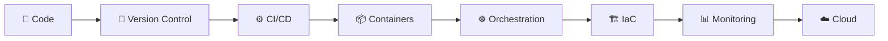

<div align="center">

<!-- Animated Header Banner -->


<!-- Typing Animation -->


<br/>

<!-- Profile Views & Social Badges -->


</div>

---

## 👨‍💻 About Me

```yaml
name: Khairullah
from: Afghanistan 🇦🇫
education:
  - degree: Master's in Data Science
    university: IMSciences, Peshawar, Pakistan 🎓
  - degree: Bachelor's in Computer Science
    university: IMSciences, Peshawar, Pakistan
passion:
  - Artificial Intelligence & Machine Learning
  - Data Science & Analytics
  - Full-Stack Web Development
  - DevOps & Cloud Engineering
  - Networking & System Administration
mission: "Leveraging AI, ML, Data Science & DevOps to solve real-world problems 🚀"
```


- 🔭 Currently working on **ML + IoT & Data Science projects**
- 🌱 Learning **DevOps, Cloud & Infrastructure as Code**
- 💬 Ask me about **Python, ML, Networking, Web Dev**
- ⚡ Fun fact: I speak **Pashto** and built a **Pashto Sentiment Analysis** model!
- 📫 Reach me at: **ibrahimkhil975@gmail.com**

<br clear="right"/>

---

## 🛠️ Tech Stack & Skills

### 👨‍💻 Programming Languages
<p>


</p>

### 🌐 Web Development & Frameworks
<p>


</p>

### 🤖 Data Science & AI
<p>


</p>

### 🖥️ Desktop & GUI Development
<p>


</p>

### 🗄️ Databases
<p>


</p>

### 🌐 Networking & IT
<p>


</p>

---

## 🚀 Complete DevOps Roadmap

<div align="center">


</div>



### 🔀 Stage 1 — Version Control & Collaboration
<p>


</p>

> ✅ Branching & Merging • ✅ Pull/Merge Requests • ✅ Git Flow • ✅ Code Reviews • ✅ GitHub/GitLab Repos Management

### 🐧 Stage 2 — Linux & Scripting
<p>


</p>

> ✅ Shell Scripting • ✅ File Systems & Permissions • ✅ Process Management • ✅ Networking Commands • ✅ Automation Scripts

### ⚙️ Stage 3 — CI/CD Pipelines
<p>


</p>

> ✅ Automated Builds • ✅ Automated Testing • ✅ Continuous Deployment • ✅ Pipeline as Code • ✅ Artifact Management

### 📦 Stage 4 — Containerization
<p>


</p>

> ✅ Dockerfiles • ✅ Images & Containers • ✅ Multi-Container Apps • ✅ Docker Networks & Volumes • ✅ Container Registries

### ☸️ Stage 5 — Container Orchestration
<p>


</p>

> ✅ Pods, Deployments & Services • ✅ ConfigMaps & Secrets • ✅ Scaling & Load Balancing • ✅ Helm Charts • ✅ K8s Networking

### 🏗️ Stage 6 — Infrastructure as Code (IaC)
<p>


</p>

> ✅ Terraform Providers & Modules • ✅ State Management • ✅ Ansible Playbooks & Roles • ✅ Configuration Management • ✅ Provisioning Automation

### 📊 Stage 7 — Monitoring & Observability
<p>


</p>

> ✅ Metrics & Alerts • ✅ Dashboards • ✅ Log Aggregation • ✅ Performance Monitoring • ✅ Incident Response

### ☁️ Stage 8 — Cloud Platforms
<p>


</p>

> ✅ EC2 / VMs • ✅ S3 / Blob Storage • ✅ VPC & Cloud Networking • ✅ IAM & Security • ✅ Serverless (Lambda / Functions)

### 🔐 Stage 9 — DevSecOps & Security
<p>


</p>

> ✅ Secrets Management • ✅ Security Scanning • ✅ Firewall Administration • ✅ Network Security (CCNA/CCNP background 💪)

<div align="center">

| 🎯 Roadmap Progress | Status |
|---|---|
| 🔀 Git / GitHub / GitLab | ✅ **Completed** |
| 🐧 Linux & Scripting | ✅ **Completed** |
| ⚙️ CI/CD (Actions, GitLab CI, Jenkins) | 🔄 **In Progress** |
| 📦 Docker & Containers | 🔄 **In Progress** |
| ☸️ Kubernetes | 📚 **Learning** |
| 🏗️ Terraform & Ansible | 📚 **Learning** |
| 📊 Prometheus & Grafana | 🎯 **Next Up** |
| ☁️ AWS / Azure / GCP | 🎯 **Next Up** |

</div>

---

## 💡 Key Projects

<table>
<tr>
<td width="50%">

### 🌱 Drip Irrigation System (ML + IoT)
Intelligent indoor plant irrigation system using multiple ML models integrated with IoT sensors for smart automation.

`Python` `Machine Learning` `IoT` `Sensors`

</td>
<td width="50%">

### 💬 Pashto Sentiment Analysis
ML models for analyzing sentiment in Pashto text — a low-resource language NLP challenge.

`Python` `NLP` `Scikit-learn` `Data Cleaning`

</td>
</tr>
<tr>
<td width="50%">

### 🎓 Student Management System
Full-featured desktop application for managing student records.

`Python` `Tkinter` `MySQL`

</td>
<td width="50%">

### 🖥️ PyQt Desktop Applications
Collection of interactive, modern desktop applications.

`Python` `PyQt` `GUI Design`

</td>
</tr>
<tr>
<td width="50%">

### ✂️ Tailor Shop Management System
Web-based application streamlining tailor shop operations, orders & billing.

`PHP` `Laravel` `MySQL` `Bootstrap`

</td>
<td width="50%">

### 🍽️ Restaurant Management System
Web application for restaurant orders, menu & inventory management.

`PHP` `JavaScript` `jQuery` `AJAX`

</td>
</tr>
<tr>
<td width="50%">

### 🤖 Machine Learning Models
Predictive analysis, classification & optimization tasks across multiple domains.

`Scikit-learn` `Pandas` `NumPy`

</td>
<td width="50%">

### 📊 Data Analysis & Visualization
Exploratory data analysis and rich visualizations for insight generation.

`Pandas` `Matplotlib` `NumPy`

</td>
</tr>
</table>

---

## 📜 Certifications

<div align="center">

| 🏅 Certification | 🏢 Institute |
|---|---|
| 🌐 **CCNA** — Cisco Certified Network Associate | CARVIT, Peshawar |
| 🌐 **CCNP** — Cisco Certified Network Professional | CARVIT, Peshawar |
| 🔥 **Firewall Administration** | CARVIT, Peshawar |
| 🖥️ **Windows Server 2016 Administration** | CARVIT, Peshawar |

</div>

---

## 📈 GitHub Stats

<div align="center">


<!-- Contribution Snake Animation (optional - requires setup) -->


</div>

---

## 📬 Connect With Me

<div align="center">

<a href="mailto:ibrahimkhil975@gmail.com">

</a>
<a href="https://wa.me/93788770458">

</a>
<a href="#">

</a>
<a href="tel:+93788770458">

</a>

<br/><br/>


<!-- Footer Wave -->


</div>
